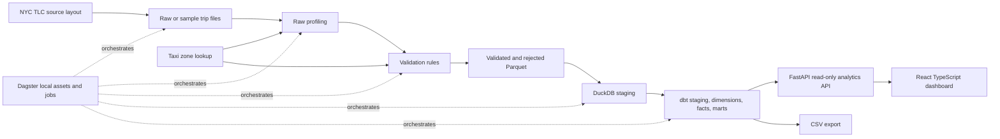
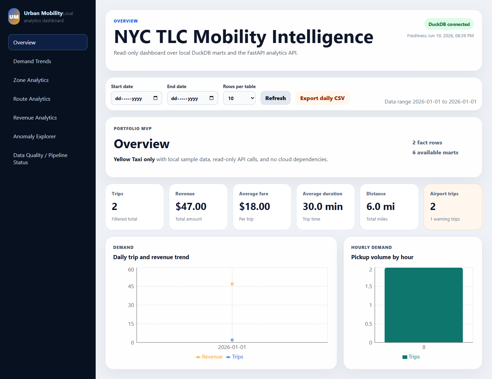
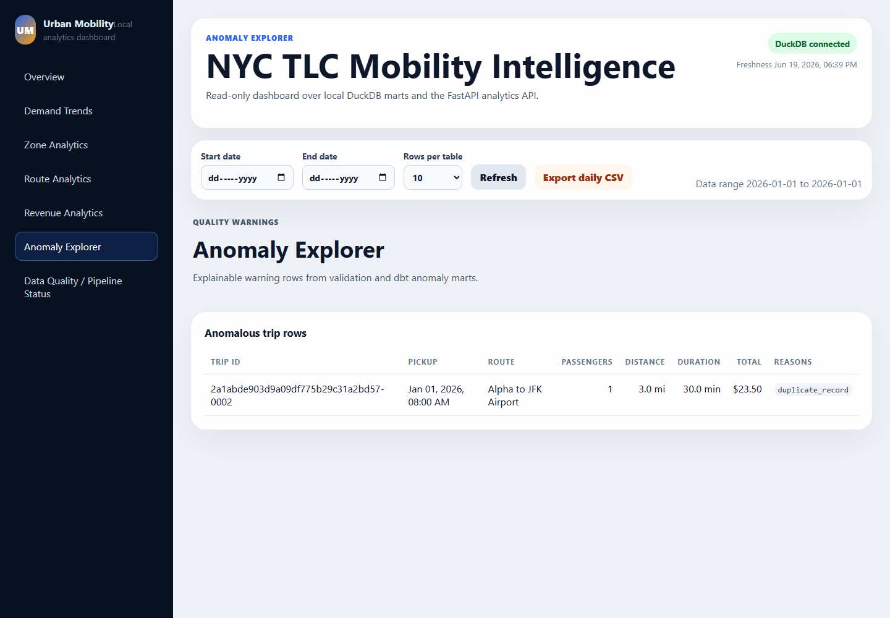
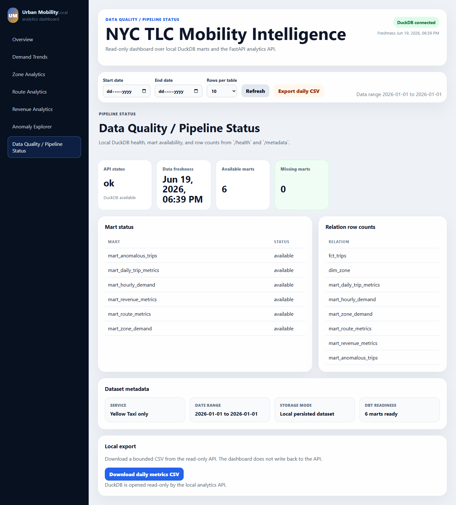
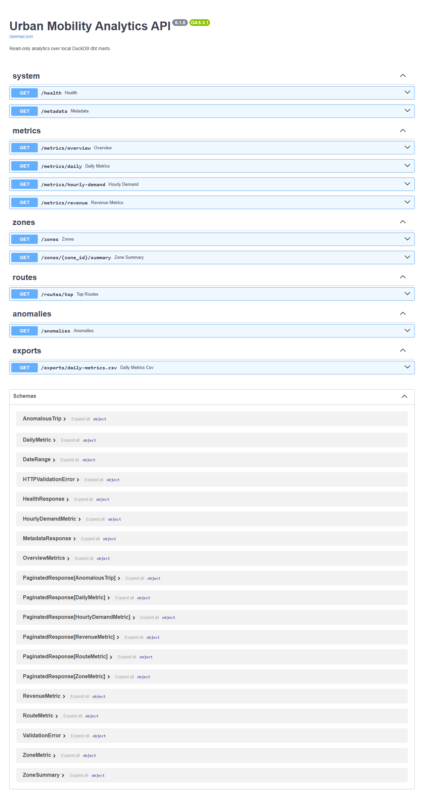

# Urban Mobility Data Platform

Local-first data engineering platform for NYC TLC Yellow Taxi analytics. The project shows a
production-style path from raw trip files to validated data, DuckDB/dbt marts, read-only FastAPI
metrics, a React dashboard, and local Dagster orchestration.

This is a portfolio project focused on data engineering fundamentals: ingestion boundaries,
quality checks, idempotent loads, dimensional modeling, orchestration, API contracts, dashboard
consumption, and reproducible local operations.

## Constraints

- Local-first: no cloud account required.
- Free tools only: no paid services.
- No Supabase, no authentication, and no API write endpoints.
- Raw data, DuckDB databases, reports, dbt targets, Dagster storage, virtualenvs, caches, and
  frontend builds are excluded from Git.
- Full dataset runs should use an external `DATA_DIR`, for example
  `C:/data/urban-mobility-data-platform`.
- The default demo uses a tiny generated local fixture and does not download official NYC TLC data.

## Architecture



## Stack

| Layer | Tools |
|---|---|
| Language/runtime | Python 3.12, TypeScript, Node.js |
| Storage | Local filesystem, DuckDB, optional local PostgreSQL Compose profile |
| Data pipeline | PyArrow, DuckDB, dbt-duckdb |
| Orchestration | Dagster local UI, assets, jobs, stopped schedule |
| API | FastAPI, Pydantic, Uvicorn |
| Dashboard | React, Vite, Recharts, Vitest |
| Quality | pytest, Ruff, pre-commit, GitHub Actions |

## Quickstart

PowerShell from the repository root:

```powershell
$env:DATA_DIR = "C:/data/urban-mobility-data-platform"
$env:DUCKDB_PATH = "$env:DATA_DIR/processed/urban_mobility.duckdb"
$env:DAGSTER_HOME = "$PWD/.dagster"

uv sync --locked --all-groups
npm install --prefix apps/web

uv run python scripts/run_demo.py --data-dir $env:DATA_DIR --year 2026 --month 1 --service yellow --sample-rows 1000
```

Run the services in separate terminals:

```powershell
uv run uvicorn apps.api.app.main:app --reload --host 127.0.0.1 --port 8000
```

```powershell
cd apps/web
$env:VITE_API_BASE_URL = "http://localhost:8000"
npm run dev -- --host 127.0.0.1
```

```powershell
$env:DAGSTER_HOME = "$PWD/.dagster"
uv run dagster dev -m dagster_project.definitions
```

## Full Local Demo

The end-to-end demo path is documented in [docs/local_demo.md](docs/local_demo.md). It covers:

1. Creating tiny local fixture data without remote downloads.
2. Profiling, validation, DuckDB loading, dbt parse/run/test/docs.
3. Dagster definition validation and asset materialization.
4. FastAPI, React dashboard, and Dagster UI startup.
5. Screenshot checklist.

## Commands

| Command | Purpose |
|---|---|
| `uv run python scripts/run_demo.py --data-dir C:/data/urban-mobility-data-platform` | Run the bounded offline fixture, profile, validation, DuckDB load, dbt build, and dbt tests |
| `make demo` | GNU Make convenience wrapper for the same bounded local demo |
| `uv run python scripts/create_demo_fixture.py --year 2026 --month 1 --service yellow --sample-rows 1000` | Create tiny offline demo data under `DATA_DIR` |
| `uv run python -m urban_mobility.download --year 2026 --month 1 --service yellow --sample-rows 1000` | Optional bounded official sample materialization |
| `uv run python -m urban_mobility.ingest inspect --year 2026 --month 1 --service yellow --mode sample --sample-rows 1000` | Write raw profile JSON |
| `uv run python -m urban_mobility.validate --year 2026 --month 1 --service yellow` | Write validated/rejected Parquet and validation summary |
| `uv run python -m urban_mobility.load_duckdb --year 2026 --month 1 --service yellow` | Idempotently replace one service/month in DuckDB staging |
| `uv run dbt run --project-dir dbt --profiles-dir dbt` | Build dbt models |
| `uv run dbt test --project-dir dbt --profiles-dir dbt` | Run dbt quality tests |
| `uv run uvicorn apps.api.app.main:app --reload --host 127.0.0.1 --port 8000` | Start FastAPI |
| `npm run dev -- --host 127.0.0.1` from `apps/web` | Start React dashboard |
| `uv run dagster dev -m dagster_project.definitions` | Start Dagster UI |
| `uv run pytest` | Run Python tests |
| `uv run ruff check .` and `uv run ruff format --check .` | Lint and format check |
| `uv run python scripts/check_repo_readiness.py` | Check publish-readiness guardrails |
| `npm test`, `npm run lint`, `npm run build` from `apps/web` | Test, typecheck, and build dashboard |

GNU Make targets exist for convenience, but PowerShell `uv` and `npm` commands above are the
supported Windows path.

## API And Dashboard

FastAPI is read-only over persisted DuckDB marts. OpenAPI is available at:

- `http://127.0.0.1:8000/docs`
- `http://127.0.0.1:8000/openapi.json`

The API also exposes `/quality/summary`, a sanitized view of the latest bounded validation
artifact. It reports valid, warning, and rejected row counts plus rule-level evidence without
exposing local filesystem paths.

The dashboard reads `VITE_API_BASE_URL`, defaults to `http://localhost:8000`, and includes:

- Overview
- Demand Trends
- Zone Analytics
- Route Analytics
- Revenue Analytics
- Anomaly Explorer
- Data Quality / Pipeline Status

Dashboard pages are loaded on demand, and empty list endpoints do not make the entire dashboard
fail. The quality page includes rejected-record counts, validation rules, and the latest artifact
name.

## Project Structure

```text
apps/api/                  FastAPI read-only analytics API
apps/web/                  React TypeScript dashboard
dbt/                       dbt-duckdb staging, dimensions, facts, marts, tests
docs/                      Architecture, data, API, operations, demo, review docs
pipelines/dagster_project/ Local Dagster assets, jobs, resources, schedules
docs/screenshots/          Verified local dashboard screenshots
scripts/                   Guardrails, cleanup, offline demo fixture
src/urban_mobility/        Downloader, profiler, validator, DuckDB loader
tests/                     Unit and integration tests with generated fixtures
```

## Screenshots

These screenshots were captured from the local fixture-backed API and dashboard:









Keep screenshots small and avoid generated raw data or database files.

## Documentation

- [Architecture](docs/architecture.md)
- [Data source](docs/data_source.md)
- [Data model](docs/data_model.md)
- [API](docs/api.md)
- [Dashboard](docs/dashboard.md)
- [Dagster](docs/dagster.md)
- [Operations](docs/operations.md)
- [Local demo](docs/local_demo.md)
- [Portfolio review](docs/portfolio_review.md)
- [Troubleshooting](docs/troubleshooting.md)
- [Final verification](docs/final_verification.md)
- [Backlog](docs/backlog.md)
- [Publish checklist](docs/publish_checklist.md)
- [Repository recap](docs/repo_recap.md)

## Verification Checklist

```powershell
uv sync --locked --all-groups
uv run pytest
uv run ruff check .
uv run ruff format --check .
uv run python scripts/check_repo_guardrails.py
uv run python scripts/check_repo_readiness.py
uv run dbt parse --project-dir dbt --profiles-dir dbt
uv run dbt run --project-dir dbt --profiles-dir dbt
uv run dbt test --project-dir dbt --profiles-dir dbt
uv run dbt docs generate --project-dir dbt --profiles-dir dbt
uv run dagster definitions validate -m dagster_project.definitions
cd apps/web
npm run build
```

## Limitations

- Yellow Taxi only.
- No production deployment is configured.
- Dagster schedule is stopped by default and local/demo only.
- The offline demo fixture is intentionally tiny and is not representative of full NYC TLC volume.
- Optional official sample materialization requires network access and DuckDB `httpfs`.

## Future Improvements

- Add Green Taxi and FHVHV data support.
- Add incremental/month partition selection in the dashboard.
- Add richer anomaly severity categories and trend comparisons.
- Add optional Docker Compose profile for dashboard plus API.
- Add a Dagster asset-graph screenshot.
- Add a backlog of hardening tasks for production deployment decisions.
