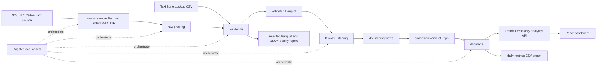
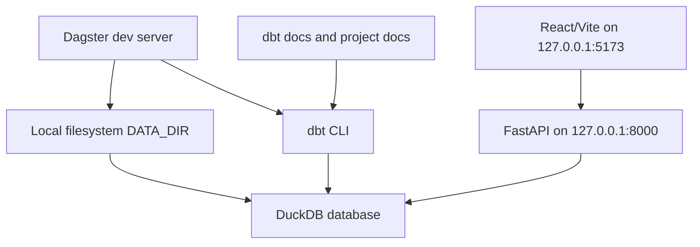
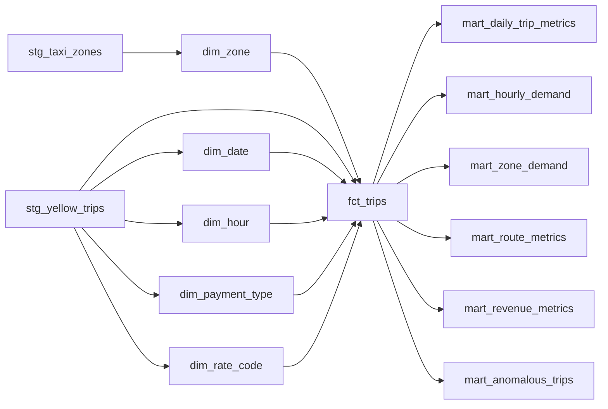

# Architecture

The platform is local-first. Files, reports, DuckDB databases, dbt outputs, Dagster storage, and
frontend builds stay out of Git. Full or long-running data work should use an external
`DATA_DIR`, for example `C:/data/urban-mobility-data-platform`.

## End-to-End Pipeline

## Local Services

## Data Model Flow

## Layer Boundaries

| Layer | Responsibility | Writes |
|---|---|---|
| Downloader/demo fixture | Materialize a bounded Parquet file and taxi zone lookup | `DATA_DIR/raw`, `DATA_DIR/sample` |
| Profiler | Produce metadata-first raw profile JSON | `DATA_DIR/reports/data_quality` |
| Validator | Classify valid, warning, and rejected rows | `DATA_DIR/processed`, `DATA_DIR/reports` |
| DuckDB loader | Idempotently replace one service/year/month in staging | `DUCKDB_PATH` |
| dbt | Build staging views, dimensions, fact, marts, tests, docs | DuckDB and `dbt/target` |
| FastAPI | Serve read-only analytics and CSV export | none |
| React dashboard | Read API data and render charts/tables | none |
| Dagster | Orchestrate existing pipeline code locally | `.dagster` metadata only |

## Design Decisions

- The API is read-only and does not expose arbitrary SQL or write endpoints.
- Validation and loading are idempotent for the same service/year/month.
- Dagster assets return small metadata dictionaries instead of large dataframes.
- The dashboard is intentionally decoupled from pipeline writes; it only reads the API.
- The default demo fixture avoids official dataset downloads and keeps the project reproducible.
