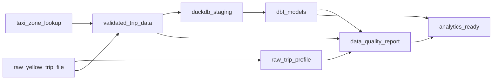

# Dagster

Dagster orchestrates the existing local pipeline. Assets call the downloader or offline fixture
outputs, profiler, validator, DuckDB loader, and dbt commands instead of duplicating business
logic.

## Environment

```powershell
$env:DATA_DIR = "C:/data/urban-mobility-data-platform"
$env:DUCKDB_PATH = "$env:DATA_DIR/processed/urban_mobility.duckdb"
$env:DAGSTER_HOME = "$PWD/.dagster"
```

`.dagster/`, temporary Dagster homes, data outputs, DuckDB files, reports, dbt targets, and builds
are ignored by Git.

## Assets



Assets:

- `taxi_zone_lookup`
- `raw_yellow_trip_file`
- `raw_trip_profile`
- `validated_trip_data`
- `duckdb_staging`
- `dbt_models`
- `data_quality_report`
- `analytics_ready`

Asset metadata includes service, year, month, paths, row counts, validation counts, DuckDB path,
dbt status, and report paths.

## Jobs And Schedule

| Definition | Purpose |
|---|---|
| `sample_ingestion_job` | Local sample pipeline with remote downloads disabled by default |
| `monthly_tlc_ingestion_job` | Monthly pipeline shape; remote downloads require explicit config |
| `analytics_refresh_job` | Validation, DuckDB staging, dbt marts, and readiness from local files |
| `local_monthly_tlc_schedule` | Local demo schedule, stopped by default |

## Commands

Validate definitions:

```powershell
uv run dagster definitions validate -m dagster_project.definitions
```

This command may emit a deprecation warning recommending `dg check defs`. The warning is
non-blocking for the current local demo; migration is tracked in [backlog.md](backlog.md).

Materialize all assets after local sample files exist:

```powershell
$env:DAGSTER_ASSETS = "taxi_zone_lookup,raw_yellow_trip_file,raw_trip_profile,validated_trip_data,duckdb_staging,dbt_models,data_quality_report,analytics_ready"
uv run dagster asset materialize --select $env:DAGSTER_ASSETS -m dagster_project.definitions
```

Start UI:

```powershell
uv run dagster dev -m dagster_project.definitions
```

Default resource values:

- `service=yellow`
- `year=2026`
- `month=1`
- `sample_mode=true`
- `sample_rows=1000`
- `allow_remote_download=false`

If local files are missing, the asset graph fails clearly instead of fetching remote data.
