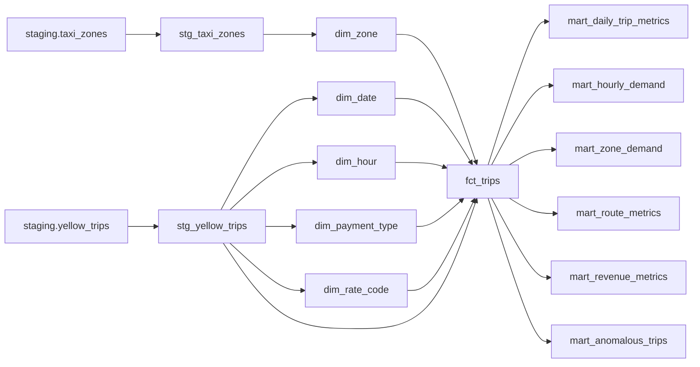

# Data Model

DuckDB stores the local warehouse. dbt builds documented views/tables for analytics and tests the
relationships that the API and dashboard rely on.

## Lineage

## Sources

| Relation | Description |
|---|---|
| `staging.yellow_trips` | Valid and warning rows produced by validation, with lineage columns |
| `staging.taxi_zones` | Normalized NYC TLC taxi zone lookup |

## dbt Models

| Model | Purpose |
|---|---|
| `stg_yellow_trips` | Typed and normalized trip staging view |
| `stg_taxi_zones` | Typed and normalized zone staging view |
| `dim_zone` | Taxi zone dimension |
| `dim_date` | Pickup date dimension |
| `dim_hour` | Pickup hour dimension |
| `dim_payment_type` | Payment type labels |
| `dim_rate_code` | Rate code labels |
| `fct_trips` | One row per loadable source-row occurrence |
| `mart_daily_trip_metrics` | Daily trip, passenger, distance, revenue, duration metrics |
| `mart_hourly_demand` | Demand by pickup date and hour |
| `mart_zone_demand` | Pickup zone demand and revenue |
| `mart_route_metrics` | Pickup/dropoff route metrics |
| `mart_revenue_metrics` | Revenue by date and payment type |
| `mart_anomalous_trips` | Explainable warning trips for inspection |

## Keys And Quality

- `stable_record_hash` identifies equivalent source records.
- `trip_id` appends a deterministic occurrence suffix to keep duplicate warnings traceable.
- Rejected rows are not loaded into `fct_trips`.
- Warning rows remain loadable so analysts can inspect anomalies without hiding them.
- dbt tests cover not-null, uniqueness, accepted values, relationships, non-negative amounts, trip
  duration, and reasonable speed.

## API Mapping

| API endpoint | Primary dbt model |
|---|---|
| `/metrics/overview` | `fct_trips` |
| `/metrics/daily` | `mart_daily_trip_metrics` |
| `/metrics/hourly-demand` | `mart_hourly_demand` |
| `/metrics/revenue` | `mart_revenue_metrics` |
| `/zones` | `dim_zone`, `mart_zone_demand` |
| `/routes/top` | `mart_route_metrics` |
| `/anomalies` | `mart_anomalous_trips` |
| `/exports/daily-metrics.csv` | `mart_daily_trip_metrics` |
